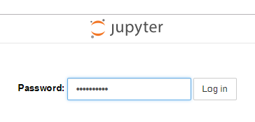

# 需求

为了更方便地学习python，就寻思着在腾讯云服务器上部署一个jupyter服务。
但是，如果只是起一个`jupyter notebook`在后台运行，那我就必须访问`ladyrick.com:8888`来访问（假设端口为8888）。
这是非常丑陋的。
我希望可以通过访问`jupyter.ladyrick.com`来访问我的jupyter服务。

另外，为了防止别人访问，只为我一个人服务，需要给jupyter服务设置密码。


<!--more-->


# 解决方案

## 1. 为jupyter设置密码

这个非常简单了。直接运行
```bash
jupyter notebook password
```
然后根据提示，输入密码即可。

这会在`~/.jupyter/jupyter_notebook_config.json`文件中写入密码的哈希值，这样以后在新浏览器登陆时，就需要输入密码。



## 2. 设置apache反向代理

首先我们先配置一下jupyter。

生成jupyter的配置文件：
```bash
jupyter notebook --generate-config
```
这会将默认配置写入`~/.jupyter/jupyter_notebook_config.py`文件。

打开配置文件，修改配置项如下：
```python
c.NotebookApp.port = 8888 # 自定义端口号。
c.NotebookApp.open_browser = False # 不打开浏览器。因为这是在命令行服务器上，自然没有浏览器。
c.NotebookApp.ip = "localhost" # 配置IP地址。localhost表明jupyter服务只能在本机访问。
c.NotebookApp.notebook_dir = "/home/username/jupyter" # jupyter的起始文件夹。不配置的话就是home文件夹。最好用绝对路径。
```

启用apache的一些mod。
```
sudo a2enmod proxy proxy_http proxy_wstunnel
```

配置apache。
在`/etc/apache2/sites-available`下新建配置文件`jupyter.conf`。
配置文件内容如下：
```apache
<VirtualHost *:80>
ServerName jupyter.ladyrick.com
ProxyRequests off

<Location />
ProxyPass        http://localhost:8888/
ProxyPassReverse http://localhost:8888/
ProxyPassReverseCookieDomain localhost jupyter.ladyrick.com
RequestHeader set Origin "http://localhost:8888"
</Location>

<Location /api/kernels/>
ProxyPass        ws://localhost:8888/api/kernels/
ProxyPassReverse ws://localhost:8888/api/kernels/
</Location>

<Location /terminals/websocket/>
ProxyPass        ws://localhost:8888/terminals/websocket/
ProxyPassReverse ws://localhost:8888/terminals/websocket/
</Location>

</VirtualHost>
```

保存关闭，并启用该配置：
```
sudo a2ensite jupyter.conf
```

最后重启apache即可:
```
sudo service apache2 restart
```

# 总结

密码配置简单，反向代理也很好配置，主要是一开始配置的反向代理，所有`ws://`协议的请求都失败了。
因此需要对websocket请求处理一下，不能直接使用顶层的配置，不然会转成http请求。
这个问题还困扰了挺久的。
